# The dev-flow flowchart

A rendered flowchart of `/dev-flow`, showing the proportional **PLAN-gate fast-path** — the
human vs auto branching, the three classifier checkpoints, and the fail-closed escalations.
For the quick-scan version, see the ASCII flow in the [README](../README.md#the-flow); for the
full spec, see [`skills/dev-flow/SKILL.md`](../skills/dev-flow/SKILL.md).

```mermaid
flowchart TD
    A([/dev-flow · task]):::start --> B

    B["Route<br/>feature vs bug · ticket?<br/>approval mode: human or auto<br/>readiness scan"]:::always --> C

    C["Recon — ALWAYS runs<br/>plan-brief / investigate-bug"]:::always --> CP1

    CP1{"Checkpoint 1 · auto path<br/>blast radius still small?"}:::auto
    CP1 -->|"bigger than it looked"| GATE
    CP1 -->|ok| D

    D["Plan the approach — ALWAYS runs"]:::always --> M

    M{"approval mode?"}:::auto
    M -->|human path| GATE
    M -->|auto path| CP2

    CP2{"Checkpoint 2 · binding<br/>tripwires + recon file list<br/>+ independent verifier subagent"}:::auto
    CP2 -->|"fail · doubt · verifier unavailable"| GATE
    CP2 -->|"trivial ✓"| AN

    GATE["⏸ PLAN gate — HUMAN<br/>surface forks · wait for approval"]:::human --> AT
    AN["announce in one line · proceed, no wait"]:::auto --> BUILD

    AT["author-acceptance-tests · human path<br/>write + commit tests (= base)"]:::humanpath --> AUD
    AUD["audit-tests · human path · FRESH subagent<br/>red-before-green adequacy"]:::humanpath --> AGCHK

    AGCHK{"any criterion with<br/>no adequate test?"}:::humanpath
    AGCHK -->|"gap found"| AESC
    AGCHK -->|clean| BUILD

    AESC["⏸ ask — HUMAN<br/>proceed anyway / strengthen tests first"]:::human
    AESC -->|strengthen| AT
    AESC -->|"proceed anyway"| BUILD

    BUILD["Build + commit each change"]:::always --> CP3

    CP3{"Checkpoint 3 · auto path · the REAL gate<br/>tripwires on cumulative diff since base<br/>side-effecting build / migration / deploy?"}:::auto
    CP3 -->|"breach"| ESC
    CP3 -->|clean| VMODE

    ESC["⏸ stop — HUMAN approves<br/>the now-non-trivial change"]:::human --> BUILD

    VMODE{"approval mode?"}:::auto
    VMODE -->|human path| VB
    VMODE -->|auto path| VRO

    VB["verify-build · human path · FRESH subagent<br/>strong model · tries to falsify the change"]:::humanpath --> VCHK

    VCHK{"verified?"}:::humanpath
    VCHK -->|yes| CR
    VCHK -->|"falsified / couldn't-verify"| VESC

    VESC["⏸ ask — HUMAN<br/>retry build / proceed with gap noted / abandon"]:::human
    VESC -->|retry| BUILD
    VESC -->|"proceed with gap noted"| CR
    VESC -->|abandon| STOP

    STOP(["stop · report why<br/>no code review, no PR"]):::human

    VRO["read-only checks only"]:::auto --> CR

    CR["Code review"]:::always --> RG

    RG["🛑 REVIEW gate — ALWAYS HUMAN<br/>hard stop · nothing pushes until approved<br/>surfaces any noted verification gap"]:::human --> PR

    PR([/pr · push + PR]):::start

    classDef start fill:#1f2937,color:#fff,stroke:#111;
    classDef always fill:#e5e7eb,color:#111,stroke:#9ca3af;
    classDef auto fill:#dbeafe,color:#0c4a6e,stroke:#2563eb;
    classDef human fill:#fee2e2,color:#7f1d1d,stroke:#ef4444,stroke-width:2px;
    classDef humanpath fill:#fef3c7,color:#78350f,stroke:#f59e0b;
```

## How to read it

- 🟥 **Red = human gates/escalations.** 🟦 **Blue = the auto-path classifier checkpoints.**
  🟨 **Amber = human-path-only test-integrity steps** (author-acceptance-tests, audit-tests,
  verify-build, and their verdict checks). ⬜ **Grey = steps that always run** — recon, planning, and
  the build itself are never skipped, on either path.
- **The auto path skips exactly one red node — the PLAN gate — and only when *all* blue checkpoints
  pass.** The last red node (the REVIEW gate) is never skippable: even an unattended run hard-stops
  there, so nothing reaches a remote unreviewed.
- **Every blue checkpoint has one escape hatch: → red.** Any breach, any doubt, or an unreachable
  verifier funnels back to a human (fail-closed). Blue can only ever *downgrade* to red, never the
  reverse — that's the whole safety story in one visual.
- **Checkpoint 3 is "the real gate"** because it's the one checking an actual diff (cumulative since
  the auto path began), and it also catches side-effecting build commands *before* they run.
- **The two amber checkpoints (audit gap, verify-build failure) are conditional escalations, not new
  structural gates** — the same category as Checkpoint 3's tripwire breach. They only exist on the
  human path, and only fire when their check finds something (a criterion with no adequate test; a
  falsified or unverifiable build); a clean run never sees them.
