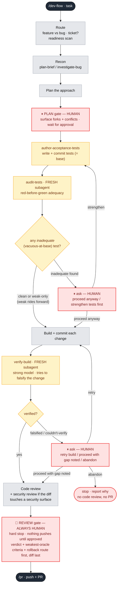

# The dev-flow flowchart

A rendered flowchart of `/dev-flow` — the two human gates, the test-integrity steps between them, and
the fail-closed escalations. For the quick-scan version, see the ASCII flow in the
[README](../README.md#the-flow); for the full spec, see
[`skills/dev-flow/SKILL.md`](../skills/dev-flow/SKILL.md).

```mermaid
flowchart TD
    A([/dev-flow · task]):::start --> B

    B["Route<br/>feature vs bug · ticket?<br/>readiness scan"]:::always --> C

    C["Recon<br/>plan-brief / investigate-bug"]:::always --> D

    D["Plan the approach"]:::always --> GATE

    GATE["⏸ PLAN gate — HUMAN<br/>surface forks + conflicts · wait for approval"]:::human --> AT

    AT["author-acceptance-tests<br/>write + commit tests (= base)"]:::testint --> AUD
    AUD["audit-tests · FRESH subagent<br/>red-before-green adequacy"]:::testint --> AGCHK

    AGCHK{"any <i>inadequate</i><br/>(vacuous-at-base) test?"}:::testint
    AGCHK -->|"inadequate found"| AESC
    AGCHK -->|"clean or weak-only<br/>(weak rides forward)"| BUILD

    AESC["⏸ ask — HUMAN<br/>proceed anyway / strengthen tests first"]:::human
    AESC -->|strengthen| AT
    AESC -->|"proceed anyway"| BUILD

    BUILD["Build + commit each change"]:::always --> VB

    VB["verify-build · FRESH subagent<br/>strong model · tries to falsify the change"]:::testint --> VCHK

    VCHK{"verified?"}:::testint
    VCHK -->|yes| CR
    VCHK -->|"falsified / couldn't-verify"| VESC

    VESC["⏸ ask — HUMAN<br/>retry build / proceed with gap noted / abandon"]:::human
    VESC -->|retry| BUILD
    VESC -->|"proceed with gap noted"| CR
    VESC -->|abandon| STOP

    STOP(["stop · report why<br/>no code review, no PR"]):::human

    CR["Code review<br/>+ security review if the diff<br/>touches a security surface"]:::always --> RG

    RG["🛑 REVIEW gate — ALWAYS HUMAN<br/>hard stop · nothing pushes until approved<br/>verdict + weakest-oracle criteria + rollback route first, diff last"]:::human --> PR

    PR([/pr · push + PR]):::start

    classDef start fill:#1f2937,color:#fff,stroke:#111;
    classDef always fill:#e5e7eb,color:#111,stroke:#9ca3af;
    classDef human fill:#fee2e2,color:#7f1d1d,stroke:#ef4444,stroke-width:2px;
    classDef testint fill:#fef3c7,color:#78350f,stroke:#f59e0b;
```

## How to read it

- 🟥 **Red = human gates and escalations.** 🟨 **Amber = the test-integrity steps**
  (author-acceptance-tests, audit-tests, verify-build, and their verdict checks). ⬜ **Grey = the
  steps that always run** — recon, planning, and the build itself.
- **The flow is linear and every node runs.** There is no fast path and no branch that skips a gate:
  a change small enough to want one doesn't need the orchestrator at all. An earlier version carried
  an auto-approving classifier that could bypass the PLAN gate for trivial changes; it was removed
  after auto-approving exactly one change in three months, and that one synthetic — see
  [`classifier-log.md`](classifier-log.md).
- **The two amber checkpoints (audit gap, verify-build failure) are conditional escalations, not
  structural gates.** They fire only when their check finds something (a criterion with an
  *inadequate* / vacuous-at-base test; a falsified or unverifiable build); a clean run never sees
  them. Everything that can go wrong funnels to a red node — fail-closed, with no path that resolves
  a doubt in the flow's own favour.
- **A `weak` (red-by-absence) audit verdict — unavoidable for a net-new pure symbol — does not fire
  the audit-gap pause.** It rides forward as a softer verified; and because it never stops the flow,
  it is exactly what `verify-build`'s attention order ranks to the top, so the REVIEW gate leads with
  it by name rather than burying it in a count.
- **The REVIEW gate is the load-bearing one.** It is never skipped and never auto-approved: even an
  unattended run hard-stops there, so nothing reaches a remote unreviewed.
