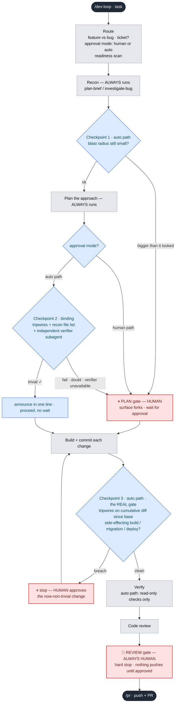

# The dev-loop flow

A rendered flowchart of `/dev-loop`, showing the proportional **PLAN-gate fast-path** — the
human vs auto branching, the three classifier checkpoints, and the fail-closed escalations.
For the quick-scan version, see the ASCII loop in the [README](../README.md#the-loop); for the
full spec, see [`skills/dev-loop/SKILL.md`](../skills/dev-loop/SKILL.md).

## How to read it

- 🟥 **Red = human gates.** 🟦 **Blue = the auto-path classifier checkpoints.** ⬜ **Grey = steps
  that always run** — recon and planning are never skipped, even on the auto path.
- **The auto path skips exactly one red node — the PLAN gate — and only when *all* blue checkpoints
  pass.** The last red node (the REVIEW gate) is never skippable: even an unattended run hard-stops
  there, so nothing reaches a remote unreviewed.
- **Every blue checkpoint has one escape hatch: → red.** Any breach, any doubt, or an unreachable
  verifier funnels back to a human (fail-closed). Blue can only ever *downgrade* to red, never the
  reverse — that's the whole safety story in one visual.
- **Checkpoint 3 is "the real gate"** because it's the one checking an actual diff (cumulative since
  the auto path began), and it also catches side-effecting build commands *before* they run.
